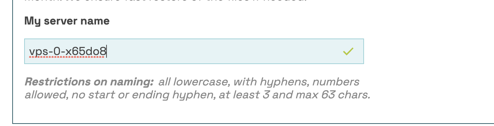
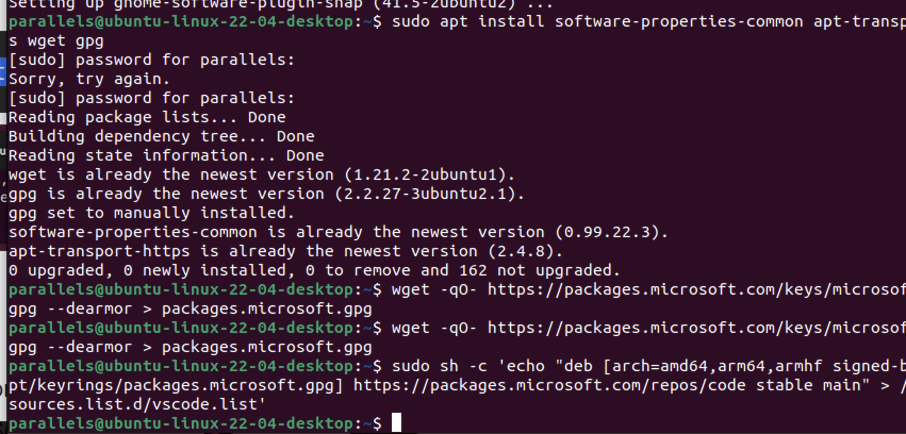
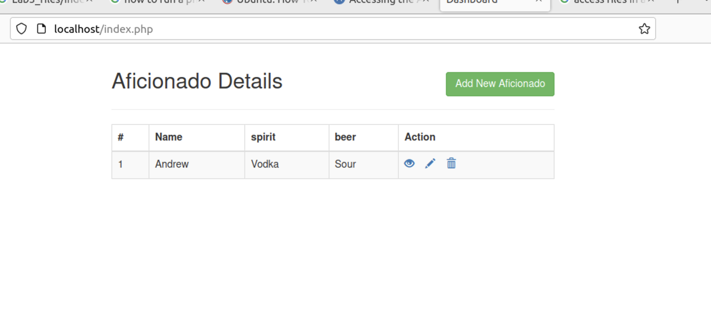

# Week 2
### [Table of Contents](https://github.com/andydhpkp/MSSE-695-SE-RD/blob/78b92f0f7c8991dc647ac5e7e3b2396296b2f7f4/Field-Journal/Table-of-Contents.md)

## To-Do
- [x] Readings
  - [x] Runeson Ch. 3
  - [x] Runeson Ch. 4
  - [x] Linux for SE

## Assignments
- [x] WR
- [x] Linux for SE

## Labs
- [x] Building Linux OS and Classic Stack

## Weekly Notes
### Lab Notes
#### Lab 1
Installation helps for Lab 1
https://ubuntu.com/server/docs/databases-mysql
https://ubuntu.com/server/docs/programming-php

#### Lab 2
Ended up hitting many roadblocks with Lab 2, mainly not understanding what the 'metal' was. I went through obtaining a USB drive and attempting to rework it to having the .iso file and running my mac from the startup help with it, but it never showed up. I got everything installed through parallels, and I attempted to use a VPS through tilaa.com. No idea if this is the best way to do it, but it was the cheapest option for a VPS and I saw that mentioned as a reason to skip the metal portion of the lab. I looked through my classmates posts, and they were helpful in getting me through a couple of the steps, and knowing that I wasn't alone with my struggles. Here are the pictures of the progress I made through Lab 2.

#### Lab 3
The CRUD challenge posed a new challenge as I have no experience with Apache. I have used mysql before, but I was tripping myself up with not setting a root password and running into errors. To actually use the apache2 server, I went into the /var/www/html directory and added the files from the github to it. I attempted to download VScode, and that ended up being a struggle because I could only get to access to a few files and I had to figure out that having the ARM vs AMD was an issue. Eventually I found a guide that helped out a lot and it was downloaded. I had to create files from the terminal and then save within VScode with sudo privileges.

### In Class Notes

### Research Project Ideas
Boundaries of what's acceptable
- Cloud server that you're going to work on (nginx)
  - Secure the server
- Deploy some sort of service on there
  - his example was nextCloud

Inspired by another student using an application they have built. They took a Lacrosse Camp registration service and chose to utilize github and buildkite to test and deploy. Look into what buildkite is and see if it sparks anything.

Potential Ideas for My Research Project:
- Use roundcube in the loser-league to operate as an email rundown/forgotten password service/yearly or weekly reminder
- Use Jenkins integration with github as an automated testing tool
- Change the storage to the Regis Cloud or some other Cloud storage for all the data
- Change the REST API to use GraphQL
- Selenium testing?

## Reflection
This week was disheartening in that I had such a hard time with all of Lab 2. I definitely struggled to make sense of what my errors were, and most of my errors lead to internet rabbit holes with no concrete answers. I was helped along the way by my classmates. They encountered similar issues, and it was very helpful to look at their various solutions. I was proud of myself when I finally got VScode downloaded, and the CRUD challenge completed, because at the start I was not very successful and I was starting to get those familiar feelings from Lab 2 that no matter what I did I would not make any real progress. But I felt very rewarded with seeing something tangible and knowing that I have at least gotten something correct with these first few labs.

## Tracked Annotations

## Hours
| Date | Time | Location | Week | Task | Duration |
| ------------- | ----------- | ---- | -- | --- | --- |
| 10/24 | 6:00 | Home | 2 | Thinking of Research and Lab 2 | 3 |
| 10/25 | 6:00 | Home | 2 | Labs 1,2, and 3 | 3 |
| 10/27 | 7:00 | Home | 2 | Labs 1,2, and 3 | 3 |
| 10/30 | 2:00 | Home | 2 | Installation helps | 4 |
| 11/2 | 7:00 | Home | 2 | CRUD | 4 |