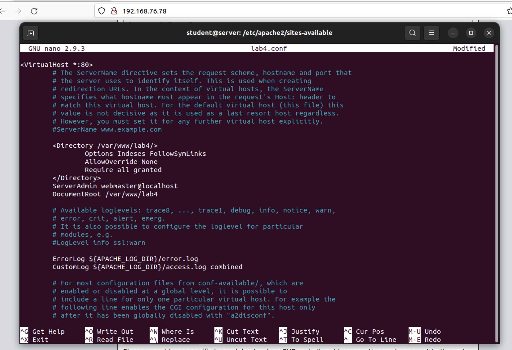
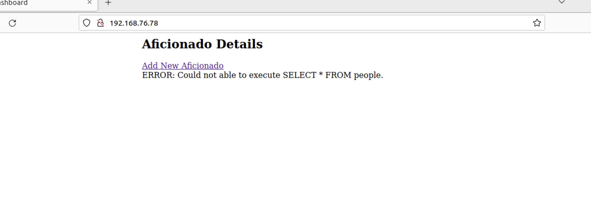
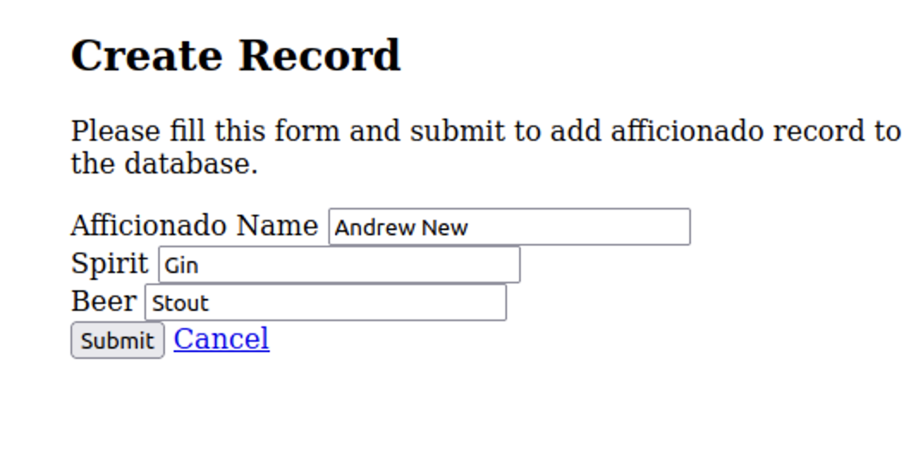
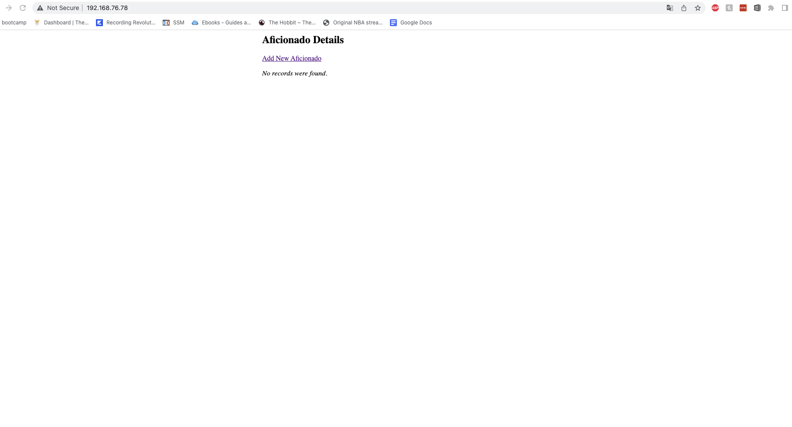
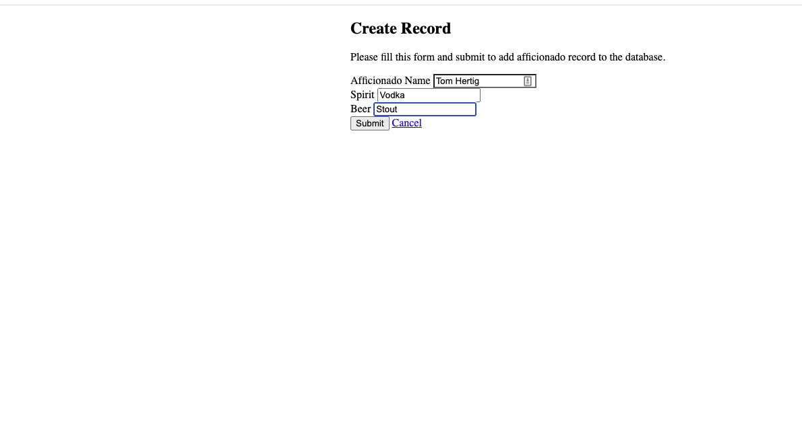
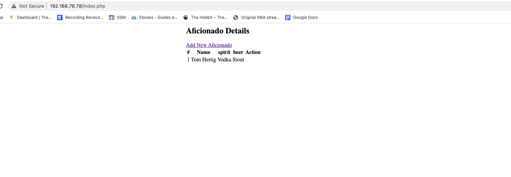
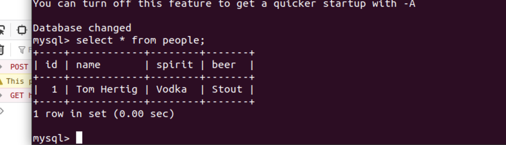
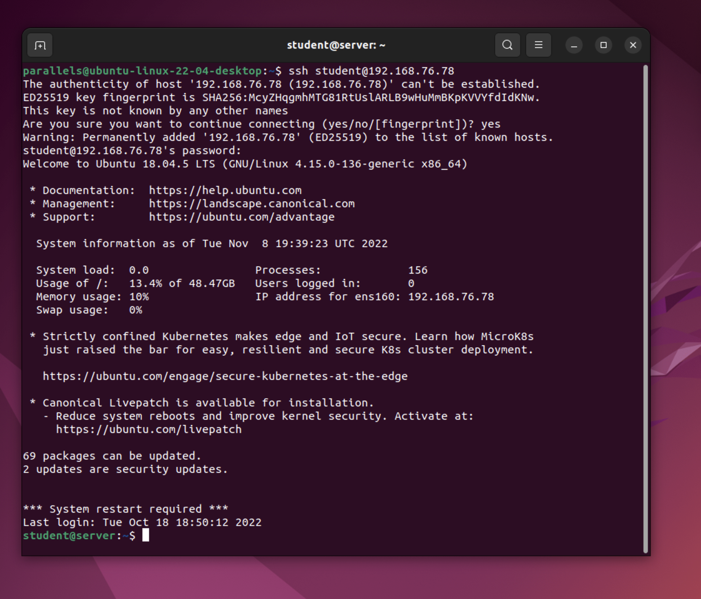

# Week 3
- [Week 3](#week-3)
    - [Table of Contents](#table-of-contents)
  - [To-Do](#to-do)
  - [Assignments](#assignments)
  - [Labs](#labs)
  - [Weekly Notes](#weekly-notes)
    - [Lab Notes](#lab-notes)
  - [Reflection](#reflection)
  - [Hours](#hours)
### [Table of Contents](https://github.com/andydhpkp/MSSE-695-SE-RD/blob/78b92f0f7c8991dc647ac5e7e3b2396296b2f7f4/Field-Journal/Table-of-Contents.md)

## To-Do
- [x] Readings
  - [x] Runeson Ch. 5
  - [x] Runeson Ch. 6

## Assignments
- [x] WR
- [ ] Annotated Bib

## Labs
- [x] Linux Server: services, webserver, database

## Weekly Notes
### Lab Notes

The IP address I selected for Regis Cloud is: FS-VM-08 192.168.76.78
The biggest headache for me with this lab was that I couldn't make the class session, and so I was lacking a step by step approach to connecting to the cloud. Thankfully, JD was very responsive over email and gave me actionable directions to get connected. I downloaded Global Protect, and logged in with credentials that JD sent me. After that it was pretty simple to repeat the first two labs in order to get things up and running. Other students field books were very helpful in terms of making the right changes to settings and as a result I didn't have to brute force change the var/wwww/html folder like I did in Lab 3. Like my classmates, I had issues with getting the bootstrap styling working.

## Reflection
This week was an unfortunately busy week at work, and I ended up getting really sick over the weekend. As a result I fell behind on my work, but thankfully JD came to the rescue for me! I am excited that the earlier issues with the labs that had placed me a bit behind with things are finally starting to make sense, and I am looking forward to getting back on track with the class. My biggest challenge was not realizing the step by step process on logging onto the regis cloud. I was thinking I had to create my own account and I just wasn't clear on how to ssh into the cloud. After reaching out to JD, I received my login and everything went pretty smooth after that. Like with most of my computer science experience, I feel very lost and frustrated when things are not working, and then suddenly I get over the hump and the feeling of seeing things work is amazing. After spending a few hours on the lab, finally seeing the CRUD app on my VM was a great feeling. With everything starting to make sense, I am hoping I can really dig into the research project and figure out how to get things going.
## Hours
| Date | Time | Location | Week | Task | Duration |
| ------------- | ----------- | ---- | -- | --- | --- |
| 2020-01-06 | 10:00 | Home | 1 | Setting up Camp | 1 |