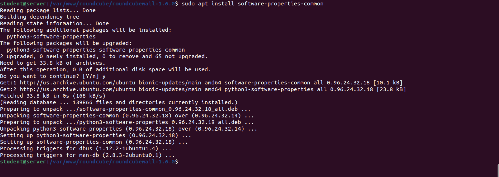
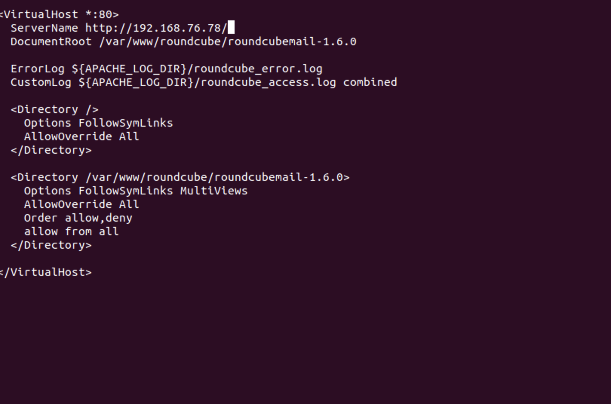

# Week 4
### [Table of Contents](https://github.com/andydhpkp/MSSE-695-SE-RD/blob/78b92f0f7c8991dc647ac5e7e3b2396296b2f7f4/Field-Journal/Table-of-Contents.md)
- [Week 4](#week-4)
    - [Table of Contents](#table-of-contents)
  - [To-Do](#to-do)
  - [Assignments](#assignments)
  - [Weekly Notes](#weekly-notes)
  - [Lab](#lab)
  - [Reflection](#reflection)

## To-Do
- [x] Readings
  - [x] Runeson Ch. 7
  - [x] Runeson Ch. 8

## Assignments
- [x] WR
- [x] Research Proposal
## Weekly Notes
## Lab
Got my ssl set up through this guide: https://devcenter.heroku.com/articles/ssl-certificate-self

Link to setup Roundcube on Ubuntu: https://www.linuxbabe.com/ubuntu/install-roundcube-webmail-ubuntu-20-04-apache-nginx

Download stable version of roundcube from repository

Extract the tarball, and move the folder to web root

Make the server user www-data as the owner of the temp and logs directory

Install necessary PHP extensions

Create Database and user for Roundcube

Create a virtual host for Roundcube

## Reflection
This week my biggest hurdle was not understanding why my port kept closing and I was not able to sign into the Regis Cloud. At first I was worried I was using the wrong IP address, or there was something that I did wrong to lose permission and access. After contacting JD, I found out that there were firewall issues, and stuff on his side of things preventing access. As far as my project goes, I have yet to fully get RoundCube setup on the cloud, but I have found an awesome resource to help me set it all up. Hopefully over the weekend I can finish with the setup, and get some more work done with next weeks lab, and the Annotated bibliography. It is super helpful to see the resources the other classmates are using because I often find myself in a rabbit hole that ends up not being helpful at all. Overall, things are starting to become more familiar and I am seeing less and less errors which is just a great feeling!