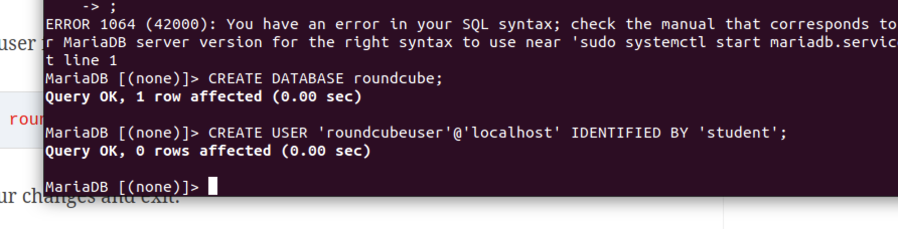

# Week 6
### [Table of Contents](https://github.com/andydhpkp/MSSE-695-SE-RD/blob/78b92f0f7c8991dc647ac5e7e3b2396296b2f7f4/Field-Journal/Table-of-Contents.md)

## Weekly Notes
Link used for Roundcube: https://geekrewind.com/install-roundcube-webmail-on-ubuntu-16-04-18-04-with-apache2-and-php-7-2-support/

Photo Updates on progress:

## Reflection

The last two weeks have been pretty challenging, with the Thanksgiving holiday, work was kind of crazy and then my flight to be with my family was during class on tuesday so I was not able to attend. I know I have been falling behind and that is unfortunate and on me. The positive of my struggles, is it gave me the idea for my recipe. I have been trying to download RoundCube for my research project, and every day it seems a new problem shows itself and my googling skills come into question. I have finally landed on a helpful guide for getting roundcube started, and I am at the very end of it. I had been following another guide, but about halfway through one of the steps was saying, "of course you did these other guides to set up x, y, and z". Sadly for me, I had not, and when I went to those guides, they contained links to more necessary guides to websites with paid services that I did not want to use. But, I found one and the problems I encountered along the way, led to my recipe. So all in all it is a full circle. These next few days I am hoping to fully have RoundCube up and running, and then I can start testing things and tweaking them and make more headway as we begin the final stretch of this class.
